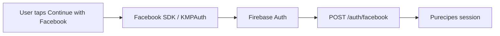

# Facebook Login Setup and Limitations

Purecipes uses **Firebase-mediated Facebook login** via [KMPAuth](https://github.com/mirzemehdi/KMPAuth): the native Facebook SDK signs the user in, Firebase Auth issues an ID token, and the app exchanges that token with our backend at `POST /auth/facebook` for a Purecipes session (same pattern as Google).

## Who can log in today

The Facebook app stays in **Development mode** until Meta **App Review** and **Business Verification** are complete. That is expected for a personal/hobby project without a registered business.

| User type | Facebook login works? |
|-----------|------------------------|
| App **Admin** / **Developer** / **Tester** (real Facebook account with a role on the app) | Yes |
| **Test users** created in the Meta dashboard (no real person required) | Yes |
| Any other Facebook user (general public) | No — shows *App not active* until the app is Live |

**Google, Apple, and email sign-in are unaffected.** Only Facebook is gated by Meta's Development/Live policy.

### Public launch blocker

To let **any** Facebook user sign in, Meta requires:

1. **Business Verification** — a verifiable legal entity (company registration, matching documents, business portfolio in Business Manager). Individual/hobby verification is not enough for Advanced Access.
2. **App Review** — screencast, privacy policy, data-deletion URL, etc.

Without a registered business, skip App Review for now and use **testers** (below) for QA and demos.

## Adding testers

Use the [Meta App Dashboard](https://developers.facebook.com/apps/) for app ID `1740550936936015`.

### Real people (recommended for friends/beta testers)

1. Open the app → **App roles** → **Roles**.
2. Click **Add People** and invite by Facebook name or email.
3. Choose a role:
   - **Administrator** / **Developer** — full dashboard access; use sparingly.
   - **Tester** — can use the app in Development mode; no dashboard access. Best for beta testers.
4. The invitee must **accept** the invitation. Invites rarely appear as Facebook notifications. They should open:
   - [developers.facebook.com/settings/developer/requests/](https://developers.facebook.com/settings/developer/requests/)
   - while logged into the Facebook account that was invited.
5. The account must be registered as a Meta developer (accept developer terms once at [developers.facebook.com](https://developers.facebook.com/) if prompted).

After acceptance, that person can tap **Continue with Facebook** in a **release** or **debug** build and complete sign-in like an admin.

### Test users (no real person)

1. App Dashboard → **App roles** → **Test Users**.
2. Create a test user (Meta generates login credentials).
3. Use those credentials in the Facebook login WebView, or log into [facebook.com](https://www.facebook.com/) as the test user first.

Useful for automated/manual QA without involving real accounts.

## What testers need in the app

- A **release** build (or debug build with a reachable backend — see [backend/README.md](../../backend/README.md)).
- Release builds call `https://purecipes.app/` (see `RELEASE_BACKEND_BASE_URL` in `shared/data/.../PlatformNetwork.kt`).
- The **production backend** must include the `/auth/facebook` route and Firebase token verification (redeploy after auth changes).

Debug builds default to `localhost:9090` (simulator) or `10.0.2.2:9090` (emulator) and only work when your machine runs the backend locally.

## Platform configuration reference

Credentials are tied to Facebook app **1740550936936015**.

| Platform | Where |
|----------|--------|
| Android | `app/src/main/res/values/strings.xml` — `facebook_app_id`, `facebook_client_token`, `fb_login_protocol_scheme` |
| Android manifest | `CustomTabActivity` + `FacebookActivity` in `app/src/main/AndroidManifest.xml` |
| Android release | Register **release signing key hash** under Facebook app → Settings → Basic → Android (package `app.purecipes`) |
| iOS | `PURECIPES_FACEBOOK_*` in `iosApp/.../project.pbxproj`; URL scheme `fb$(PURECIPES_FACEBOOK_APP_ID)` in `Config/Info.plist` |
| iOS SDK | Swift Package `facebook-ios-sdk` — products **FacebookCore** and **FacebookLogin** (not CocoaPods) |
| Firebase | Authentication → Sign-in method → **Facebook** enabled; App ID + App Secret; OAuth redirect URI added to Facebook Login → Valid OAuth Redirect URIs |

### Android key hash (release)

If release builds fail at the Facebook screen with invalid key hash:

```bash
keytool -exportcert -alias YOUR_RELEASE_ALIAS -keystore YOUR_RELEASE_KEYSTORE | openssl sha1 -binary | openssl base64
```

Add the output to the Facebook Android platform settings for package `app.purecipes`.

## End-to-end flow



Backend verification skips `email_verified` for Facebook tokens (Firebase sets it to `false` for Facebook sign-ins by design). Password sign-in still requires verified email.

## Common errors

| Symptom | Likely cause |
|---------|----------------|
| *App not active* | Account has no role on the Facebook app, or invite not accepted |
| *Email address is not verified* (old backend) | Production backend missing the Facebook provider fix; redeploy |
| *Not Found* on Account screen | Production backend missing `POST /auth/facebook`; redeploy |
| Invalid key hash (Android release) | Release keystore hash not registered in Facebook dashboard |
| Login works locally but not in release | Debug build points at localhost; use release + `https://purecipes.app/` |

## Facebook App Review artifacts (when you have a business)

Only needed after Business Verification:

- **Android:** `./gradlew :app:assembleRelease` → `app/build/outputs/apk/release/app-release.apk`
- **iOS Simulator:** Xcode **Release** configuration, simulator destination, zip `PurecipesIOSApp.app`
- **Review notes:** Account → Continue with Facebook → grant permissions → signed-in Account screen
- Reviewer must use a role/test account while the app remains in Development mode, or the app must be Live after approval

## Related docs

- [002_authentication.md](../features/002_authentication.md) — overall auth feature
- [backend/README.md](../../backend/README.md) — running and deploying the backend
