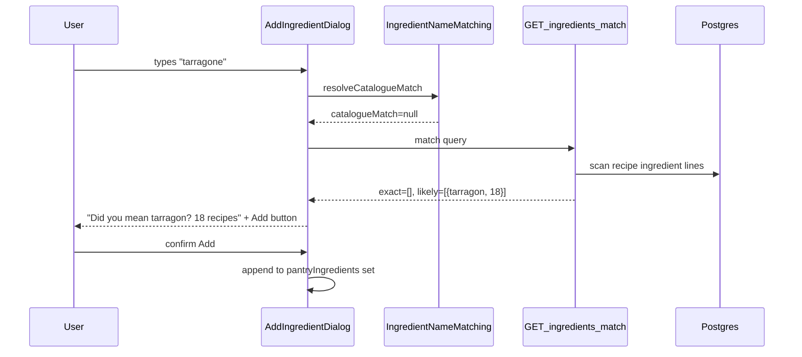

# Feature 013: Custom Pantry Ingredients

## Status: <span style="color:green;">🟢 ACCEPTED</span>

Scheduled for **Phase 2** (alpha), alongside advanced recipe search.

## Feature Overview

Let signed-in users add free-text ingredients to their pantry from the search filter sheet. Added items behave like catalogue pantry chips (tri-state: in pantry / excluded / neutral) and participate in the existing backend search post-filtering via `IngredientNameMatching`.

This makes more recipe ingredients discoverable and useful for search, especially when the static `IngredientCatalogue` does not list an ingredient the user has on hand, or when the user knows an ingredient by an alternative name (for example courgette vs zucchini).

## User Story

As a home cook, I want to add ingredients not listed in the catalogue to my pantry so I can discover recipes that use them and filter search results with the same include/exclude controls as catalogue items.

## Problem Today

- Pantry UI only renders `IngredientCatalogue.groups` chips in `IngredientFilterSection`.
- `user_pantry` and `user_excluded_ingredients` already store arbitrary `TEXT`, but non-catalogue names are invisible in the UI.
- There is no add flow, no catalogue hint, and no ingredient match preview when typing a name.

## Core Functionality

### Your ingredients section

New collapsible group at the bottom of the Pantry tab in `FilterBottomSheet`, after catalogue groups.

- Section title: **Your ingredients**
- Primary action: **Add ingredient** (opens a dialog)
- Shows tri-state chips for custom items: `(pantry ∪ excluded) - IngredientCatalogue.allItems`

### Add ingredient dialog

- Single-line text field (trimmed input)
- Debounced preview panel
- Cancel and Add to pantry actions

### Catalogue resolution (client-side, instant)

Before or while the server responds, resolve against `IngredientCatalogue.allItems` using `IngredientNameMatching.ingredientVariants()`.

| Input case | UI behaviour |
|------------|--------------|
| Alias match (e.g. courgette → Zucchini) | Non-blocking hint: *Matches Zucchini in our catalogue.* User can add their typed name or tap **Use Zucchini**. |
| Exact catalogue match | *Already in the catalogue — select it above.* Optional scroll hint to the catalogue chip. User can still add if they insist (dedupe on save). |
| Already in pantry / excluded | Show current state. |

**Alias strategy:** Do not silently rewrite user input. Matching already works via `IngredientAliasGroups` (courgette ↔ zucchini). Show the catalogue hint instead; offer a one-tap shortcut to add the catalogue name.

### Ingredient match preview (server-side, debounced)

New endpoint searches the recipe corpus for **ingredient** matches against the typed text. This is not a pantry-coverage check.

#### Exact match

The query matches an ingredient name as-is after normalization — for example `"tarragon"` matches recipe lines containing tarragon. Uses existing `IngredientNameMatching` rules (word-boundary, plurals, known aliases). Typos already listed in `IngredientAliasGroups` (for example `corainder` → coriander) resolve as exact, not likely.

#### Likely match

Close but not exact — for example `"tarragone"` → likely `"tarragon"`. Requires new fuzzy matching (edit-distance or similar) against a vocabulary built from `IngredientCatalogue` plus distinct tokens extracted from recipe ingredient lines.

#### Response shape

```json
{
  "query": "tarragone",
  "exactMatches": [
    { "ingredient": "Tarragon", "recipeCount": 0 }
  ],
  "likelyMatches": [
    { "ingredient": "Tarragon", "recipeCount": 18, "confidence": 0.92 }
  ]
}
```

Grouped by matched ingredient name with recipe counts per tier.

| Query example | Typical result |
|---------------|----------------|
| `"tarragone"` | Likely matches only |
| `"tarragon"` | Exact matches only |
| Ambiguous / niche spelling | Both tiers possible; recipes deduped into exact first, remainder in likely |

#### Dialog preview

- Catalogue hint (client-side, if any)
- **Exact matches:** *Tarragon — 24 recipes*
- **Likely matches:** *Did you mean tarragon? — 18 recipes* (offer to add suggested name)
- Both sections when applicable
- Already-in-pantry state

### Tri-state chips for custom items

Same neutral → in pantry → excluded → neutral cycle as catalogue chips. No alias-sibling sync for custom names; aliases are handled at match time when filtering recipes.

### Persistence

Unchanged storage model (`user_pantry` / `user_excluded_ingredients`). Custom names stored as typed unless the user chooses a catalogue or likely-match shortcut.

## UI Layout

```
Pantry tab
├── Intro + legend
├── Bulk select/clear
├── [Catalogue groups: Poultry, Vegetables, ...]
└── Your ingredients
    ├── [custom tri-state chips]
    └── [Add ingredient]
```

## Technical Implementation

### Data flow



### Layer breakdown

| Layer | Work |
|-------|------|
| **shared/domain** | `resolveCatalogueIngredient(query, catalogueItems): String?` for client-side catalogue hints. `findLikelyIngredientMatches(query, vocabulary, maxDistance)` for fuzzy tier. Unit tests: courgette→Zucchini, tarragone→tarragon, tarragon→exact only. |
| **backend** | `GET /ingredients/match?name=...` in new `IngredientsRoutes`. Build ingredient vocabulary from catalogue + recipe corpus. Return exact and likely match groups with recipe counts. Cap or cache if scan cost is high. |
| **shared/data** | Ktorfit method + `IngredientMatchResponse` on `PurecipesApi`. |
| **feature/search/domain** | `MatchIngredientInRecipesUseCase`. |
| **feature/search/ui** | `YourIngredientsSection`, `AddIngredientDialog`, wire into `PantryFilterTabContent`. |
| **Tests** | Domain resolver + fuzzy match tests; backend route tests (exact-only, likely-only, both tiers); UI test for dialog + custom chip visibility. |

### API sketch

```
GET /ingredients/match?name=tarragone
```

Response model in `shared/domain` so backend and clients share the same shape.

### Matching notes

- **Exact tier:** reuse `IngredientNameMatching.matchesAnyIngredient()` against recipe ingredient lines.
- **Likely tier:** new fuzzy helper; compare normalized query to vocabulary tokens; assign recipes to the best-matching ingredient name above a confidence threshold.
- **Deduping:** a recipe counted under exact for a given ingredient is not also counted under likely for the same ingredient.

## Platform Considerations

- **Android / iOS / Wasm:** shared Compose UI in `feature/search/ui`; dialog and chips follow existing filter sheet patterns.
- **Backend:** authenticated endpoint; scan published recipes only.
- **Offline:** catalogue hints work offline; ingredient match preview requires network (show graceful empty state when offline).

## Dependencies

- Feature 002: Authentication (pantry persistence requires sign-in)
- Feature 005: Basic recipe search
- Feature 012: Advanced recipe search and pantry filter sheet

## Success Metrics

- % of signed-in users with at least one custom ingredient
- Add-dialog completion rate
- % of likely-match suggestions accepted (user adds the suggested canonical name)
- Search result engagement after adding custom ingredients

## Out of Scope (v1)

- Ingredient autocomplete / typeahead list
- Admin review of custom names
- Auto-expanding `IngredientCatalogue` from user submissions
- Pantry-coverage preview (recipes fully makable with current pantry + new item)

## Future Enhancements

- Promote frequently added custom names into `IngredientCatalogue` or `IngredientAliasGroups` via admin tooling
- Client-side cache of ingredient vocabulary for faster likely-match hints
- Batch add (paste a shopping list)

## Current Status: ACCEPTED

Reason: Extends the pantry system so users can represent what they actually have on hand, improving recipe discovery without waiting for catalogue updates. Builds on existing pantry persistence and `IngredientNameMatching` infrastructure.
